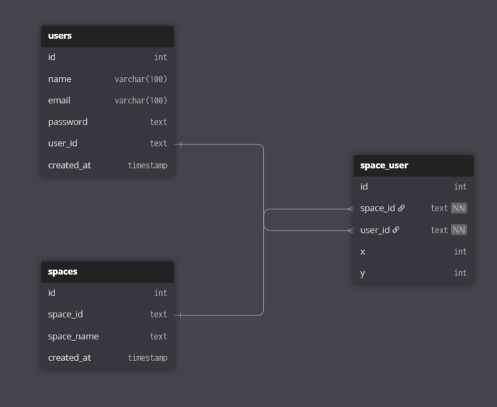

# 🌐 Metaverse Real-Time Multiplayer Project

A real-time multiplayer **Metaverse** application where users can join and interact in dynamic virtual spaces. Built using **React.js**, **Node.js**, **TypeScript**, **Socket.IO**, and **MySQL**, this project emphasizes real-time interactions, room-based logic, and multiplayer movement coordination.

---

## ✨ Features

- Real-time user movement (x, y) syncing
- Space (room) creation and joining
- WebSocket communication using Socket.IO
- JWT-based authentication
- MySQL database for users and spaces
- Full TypeScript support on both client and server
- Scalable modular codebase

---

## ⚙️ Tech Stack

### Frontend:
- React.js + Vite
- TypeScript
- Tailwind CSS
- React Router DOM
- Axios

### Backend:
- Node.js + Express
- TypeScript
- Socket.IO
- MySQL (`mysql2` & `createPool`)
- JWT for authentication
- dotenv & cookie-parser

---

# Architecture
## Notion 
 https://safe-cheshire-8a0.notion.site/Meta-verse-2254f5435a56802b9e0be4ba89e06c30?pvs=73

# Database Schemma


# Run on your Machine
```bash
git clone https://github.com/david-rai/metaverse.git
cd frontend
npm run dev

cd..
cd backend
npm run manual
``